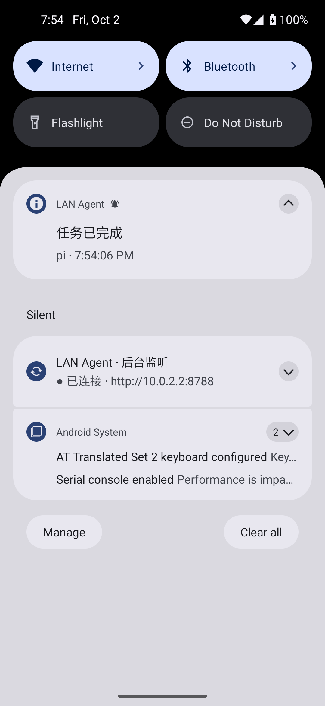

# LAN Agent / 安卓 AI 移动控制室

通过局域网连接 Windows 电脑 WSL 中的 **pi / Codex**：手机输入任务、查看回复和公开思考/推理摘要、切换模型、查看工具与计划进度，并接收完成/待选择系统通知。

架构：**原生 Android Java APP → WebSocket → WSL Node.js 桥接 → pi RPC / Codex app-server**。电脑同时提供 Web 控制面板，与 APP 共享会话。

## 下载

- [Android APK · v1.0.0](https://github.com/anlen123/app_connect_ai/releases/download/v1.0.0/lan-agent-1.0.0.apk)
- [Release / 校验信息与源码包](https://github.com/anlen123/app_connect_ai/releases/tag/v1.0.0)
- Android **8.0+**，包名 `dev.lanagent`。
- 首个可安装测试版，**debug 签名**，不是应用商店发行版。
- APK SHA-256：`45a60de384c22f2a94ce8d3204e295b66d25d8df00fe37da673e319aa32b57d9`。

APK 不放入 Git 历史，安装包与源码快照作为 Release 附件发布。桥接的 `/app.apk` 下载功能需要把下载的 APK 放入 `artifacts/lan-agent-1.0.0.apk`。

## 功能

- 局域网 IP / 二维码配对；手机无需填写 AI API key。
- pi / Codex 多会话，手机与电脑保持同一对话上下文。
- 实时回复、公开思考/推理摘要、工具调用/输出、计划步骤和任务状态。
- 模型列表来自真实 agent，可在手机或电脑切换，保留对话。
- pi 选择、确认、文本输入、编辑交互；Codex 命令/文件审批、用户问题和 MCP elicitation。
- pi 附带 `lan_ask_user` 工具，避免使用 RPC 不支持的自定义终端 UI；`/lan-check` 可测试选择回传。
- Android 前台监听、自动重连、遗漏完成通知回放、事件序号去重；点击通知定位会话。
- 配对码在 Android Keystore 中加密保存，禁止备份。

**思考边界：**只展示提供方实际公开的 thinking 或 reasoning summary，不伪造隐藏思考，不解密签名。pi 支持时默认 medium thinking，Codex 请求公开摘要；不返回思考的模型不会产生假的思考段。

## 部署：Windows + WSL

已实测 Node.js 22.23.2、pi 1.0.0（`@earendil-works/pi-coding-agent`）、codex-cli 0.160.0。pi 需支持 `agent_settled` 和对应 RPC 命令，旧版本请升级。

### 1. 在 WSL 安装并登录

```bash
git clone https://github.com/anlen123/app_connect_ai.git
cd app_connect_ai/bridge
npm ci --omit=dev --ignore-scripts
npm install -g --ignore-scripts @earendil-works/pi-coding-agent@1.0.0 @openai/codex@0.160.0
# 运行 pi 后 /login；Codex 使用 codex login。
```

桥接继承启动用户的 agent 配置与凭据，不把 API key 发给手机。

### 2. 启动 WSL 桥接

从要让 agent 操作的项目目录运行，替换示例地址为 **Windows 的局域网 IP**：

```bash
cd /path/to/your/project
LAN_URL=http://192.168.1.10:8787 /path/to/app_connect_ai/scripts/start-bridge.sh
```

| 环境变量 | 默认 | 含义 |
|---|---|---|
| `LAN_URL` | `http://127.0.0.1:8787` | 二维码中手机可访问的地址，务必设置 Windows LAN IP |
| `PORT` / `HOST` | `8787` / `0.0.0.0` | 监听端口/地址 |
| `AGENT_ROOT` | 启动目录 | 会话工作目录不得越出该根目录 |
| `DATA_DIR` | `$HOME/.local/share/lan-agent` | 私有配对码与历史 |
| `PI_BIN` / `CODEX_BIN` | `pi` / `codex` | CLI 路径 |
| `PAIR_TOKEN` | 自动生成并持久化 | 可选自定义配对码，至少 24 字符 |

最多 8 个活动 agent 进程。不用的会话可关闭，历史保留。WSL 重启后需重新启动桥接。

### 3. Windows NAT 转发

在 **管理员 PowerShell** 执行，替换 IP 与发行版名称（`wsl -l -q` 查看）：

```powershell
.\scripts\windows-lan.ps1 -ListenAddress 192.168.1.10 -Distro Ubuntu
```

脚本仅绑定指定 LAN 地址，防火墙仅允许 `LocalSubnet`。WSL 重启后 IP 可能变化，需要重新运行。镜像网络需按实际 Windows/Hyper-V 防火墙配置放行，不需要 NAT portproxy。

撤销规则：

```powershell
.\scripts\windows-lan.ps1 -ListenAddress 192.168.1.10 -Distro Ubuntu -Remove
```

### 4. 配对与使用

1. 电脑打开 `http://localhost:8787`，输入桥接终端显示的配对码，点击 **手机配对**。
2. 安装 APK，允许通知；扫码或手动填写地址和配对码。
3. APP `＋` 新建 pi/Codex 会话，选择项目目录并输入任务。
4. 模型名称旁的 `▾` 切换模型；运行中先停止或等待完成。`⋯` 可关闭会话进程。
5. 完成/待选择会发系统通知；点击返回对应会话，选项或输入直接回传。

可用 PowerShell launcher 自动读取 WSL 私有 token 并打开面板：

```powershell
.\scripts\open-dashboard.ps1 -Distro Ubuntu -TokenPath /home/your-user/.local/share/lan-agent/token
```

自动登录采用 URL fragment，不放入 HTTP 查询参数，页面马上清除 fragment。`open-dashboard.cmd` 是 Windows 快捷入口；其脚本默认 `Arch` 和 `/root/...`，其他环境请指定参数或调整默认值。

## 通知、数据与安全

- Android 13+ 必须允许通知，APP 底部可进入通知设置。为锁屏实时接收，请允许后台网络、电池“不受限制”，避免厂商省电工具强杀。
- 通知栏“断开”停止手机监听，不会停止电脑任务。离开局域网、强制停止 APP 或 WSL 休眠时不能立即通知；重连后回放已监控会话的遗漏完成事件。
- 同步的是**桥接创建的会话**，不附着于已经独立运行的终端 TUI。可从电脑面板创建任务，再用手机查看和处理。
- 默认 HTTP/WebSocket **明文**，仅用于可信局域网。配对码和二维码是访问权限凭据，不要分享，不要开放公网端口；不可信网络请使用 TLS 反向代理。
- Codex 使用 `workspace-write` sandbox、`on-request` 审批；广泛 permissions 请求只允许拒绝。pi 没有 OS sandbox，执行权限与启动用户相同，项目目录限制不等于安全沙箱。
- `DATA_DIR` 保存私有 JSONL 历史与 token；不要上传。桥接重启后保留历史并标为 offline，需要新建进程继续，不假装恢复已结束的 agent。
- 实时窗口保留最近 10,000 个事件，完整事件保存在电脑私有日志内。初次配对不会对所有历史完成重新报警。

## 构建与测试

```bash
# Java 17、Android SDK 35，设置 ANDROID_HOME
cd android
./gradlew :app:assembleDebug :app:lintDebug
# app/build/outputs/apk/debug/app-debug.apk

cd ../bridge
npm ci --ignore-scripts
npm test
node test/real-smoke.js        # 真实 agent 登录后：只读工具调用
node test/real-interaction.js  # 真实 pi RPC 选择交互，无模型费用
node test/fixture-server.js    # 独立测试服务，8788
# 另一终端
npx playwright install chromium
npx playwright test
cd ../android
./gradlew :app:connectedDebugAndroidTest -Pandroid.testInstrumentationRunnerArguments.class=dev.lanagent.EndToEndTest
```

`RealAgentTest` 接收 `realUrl` / `realToken` 参数；此验证用例使用 `lan-agent/bridge/test` 工作目录，复现时将桥接根目录设置到包含该路径的目录或调整测试目录。不要把真实配对参数写进公开 CI 日志。

验证：**7 个桥接单测、2 个浏览器测试、2 个 Android 交互/扫码/通知测试、1 个真实 Windows LAN→WSL→pi/Codex 测试**均通过；APK 编译、lint、签名验证通过，依赖审计 0 漏洞。详见 [VERIFICATION.md](VERIFICATION.md)。实体手机与厂商电池策略差异未声称已实测。


