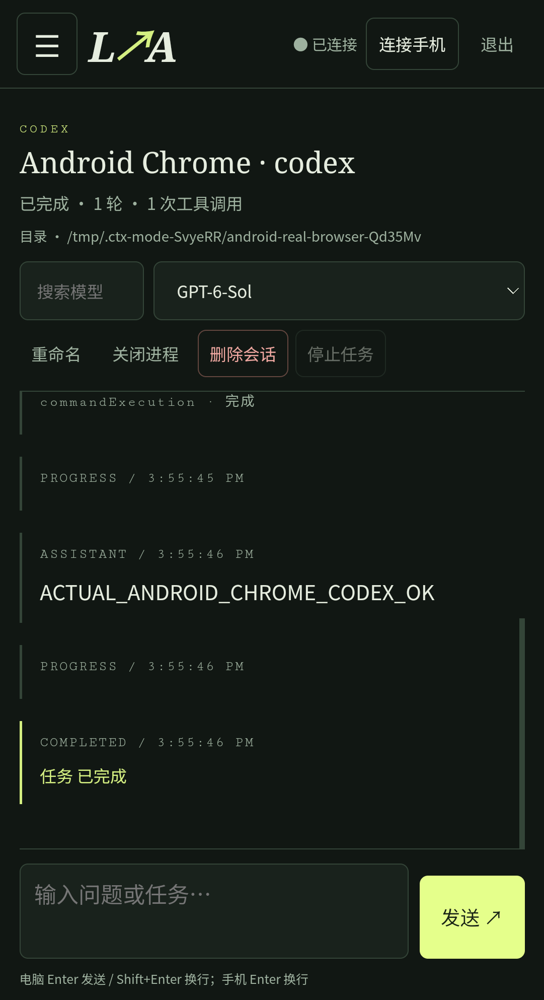

# LAN Agent / Linux 局域网 AI 控制台

**在普通 Linux 上启动一个网页，电脑和手机访问同一个地址**：选择 **pi / Codex**、新建聊天、发送任务、切换模型、查看实时输出，并删除会话。**不需要 Windows、WSL 或安装手机 APP。**

架构：浏览器 → 鉴权 WebSocket → Linux Node.js 服务 → 真正的 pi RPC / Codex app-server。可选 Android APP 与网页共享会话，并提供后台系统通知。

> 请使用 **v1.1.0 或更新版本**。v1.0.0 网页错误依赖只在安全来源可用的 `crypto.randomUUID()`，在普通局域网 HTTP 下无法创建会话；旧测试只用了 localhost，漏掉了这个问题。v1.1.0 已修复，并在非 localhost HTTP、桌面/手机视口、实际 Android Chrome 上用真实 pi/Codex 验证。

## Linux 快速开始

需要 Node.js **22+**，以及至少一个已安装并登录的 agent。服务继承启动用户的 CLI 配置和 AI 凭据，手机不用填写 AI API key。

```bash
git clone https://github.com/anlen123/app_connect_ai.git
cd app_connect_ai/bridge
npm ci --omit=dev --ignore-scripts

# 按需安装其中一个或两个；以下是已实测版本。
npm install -g --ignore-scripts @earendil-works/pi-coding-agent@1.0.0 @openai/codex@0.160.0
# pi：启动 pi 后执行 /login；Codex：执行 codex login。

# 把 /path/to/project 替换为 agent 可以操作的 Linux 项目目录。
AGENT_ROOT=/path/to/project ../scripts/start-bridge.sh
```

1. 终端显示网页地址和私有配对码。电脑访问 `http://<Linux局域网IP>:8787`，输入配对码。
2. 手机连接同一网络，访问**同一个地址**并输入配对码；或点击电脑网页的 **手机连接**，用手机相机扫描网页二维码直接打开并登录。
3. 点击 **＋ 新建会话**，选择 agent、名称、项目内目录；等待初始化后输入任务。
4. 顶栏选择模型；切换后会在新模型上继续当前对话。运行中的任务请先停止或等待完成。
5. **删除会话**会停止该 agent，删除本服务会话和历史，电脑/手机同步移除。**关闭进程**仅停止，保留历史。

手机网页 Enter 换行，使用发送按钮提交。网页会自动重连并回放历史。若手机连接不了，检查 Linux 防火墙是否允许可信局域网访问 TCP 8787、Wi-Fi 是否开启客户端隔离。`/health` 只证明服务在线，不等于聊天流程测试通过。

### 配置

| 环境变量 | 默认 | 说明 |
|---|---|---|
| `HOST` / `PORT` | `0.0.0.0` / `8787` | 监听地址和端口 |
| `LAN_URL` | 自动发现 Linux IPv4 | 可选手工指定手机可访问的完整地址，如多网卡或反向代理 |
| `AGENT_ROOT` | 启动脚本时的工作目录 | 所有会话目录必须位于该根目录内 |
| `DATA_DIR` | `$HOME/.local/share/lan-agent` | 私有配对码、索引及 JSONL 历史 |
| `PI_BIN` / `CODEX_BIN` | `pi` / `codex` | CLI 路径 |
| `PAIR_TOKEN` | 自动生成并持久化 | 可选配对码，至少 24 字符；不要写进公开配置 |

最多 8 个活动 agent 进程。未安装的 agent 在网页中明确提示。重启服务后历史保留，但原进程不能假装恢复，旧会话显示离线；新建会话开始新的任务。

服务默认前台运行，可用自己的 systemd 用户服务或终端进程管理器保持运行。不要将私有配对码打印到公开 CI 日志。

## 功能与边界

- 桌面/手机同一响应式网页，支持多会话、重命名、关闭、删除、模型搜索、任务停止、跨端状态同步。
- 实时回复、公开思考/推理摘要、工具调用/输出、计划及完成/失败状态。
- pi 选择、确认、输入/编辑；Codex 命令/文件审批、用户问题和 MCP elicitation。
- pi 注册 `lan_ask_user` 工具；`/lan-check` 可验证实际选择回传，答案不被未完成的 prompt 锁阻塞。
- 模型列表来自 agent，不承诺所有账户都具有相同模型或额度。真实测试中切换模型后执行了新的推理，不仅修改显示名称。
- 只转发提供方公开的 thinking/reasoning summary，不伪造内部思考。没有公开摘要的模型不会出现假的思考段。
- 共享的是**本服务创建的会话**，不附着于已有的独立终端 TUI。
- 删除仅移除本服务的会话/历史，不删除项目文件，也不承诺清除 CLI 或提供方自己保存的记录。

## 可选 Android APP / 后台通知

手机网页已具备完整聊天和会话管理功能，**APK 不是使用前提**。如果需要锁屏后的系统通知，可安装 Android 8.0+ 测试客户端：

- [v1.1.0 Release：APK、源码 ZIP、SHA256SUMS](https://github.com/anlen123/app_connect_ai/releases/tag/v1.1.0)
- [下载 lan-agent-1.1.0.apk](https://github.com/anlen123/app_connect_ai/releases/download/v1.1.0/lan-agent-1.1.0.apk)
- 包名 `dev.lanagent`；版本 `1.1.0` / versionCode 2；**debug 签名测试包，不是商店发行版**。
- APK SHA-256：`d2722049b98e241c1b813cde345c158302b487fe738d5c88530c1da6fbd21d15`。

APP 支持 IP/配对码、网页二维码与 JSON 配对二维码、前台监听、重连补发通知、通知定位/回答、模型切换、关闭和删除。Android 13+ 需要通知权限；锁屏监听还需允许后台网络，并避免厂商省电工具强杀。配对码使用 Android Keystore 加密，禁止备份。

**普通 HTTP 手机浏览器不能保证系统通知，尤其关闭网页或锁屏后。**网页内状态正常展示；浏览器通知需要安全来源、权限及平台支持。即使 HTTPS，本项目也没有承诺网页关闭后的推送服务。APP 离线/强制停止或 Linux 休眠时也无法立即通知，重连后回放已监控会话。

把 Release APK 放入 `artifacts/lan-agent-1.1.0.apk` 后，服务可通过 `/app.apk` 提供下载。二进制不放 Git 历史。

## 安全

- 默认 HTTP/WS 明文，**仅用于可信局域网**。配对码和二维码代表远程操作权限，不要分享或开放公网；不可信网络请使用 TLS、网络隔离和最小权限用户。
- 扫码自动登录使用 URL fragment，不把配对码放到 HTTP 查询参数，页面随即清除 fragment。
- 不要上传 `DATA_DIR`、配对码、AI 凭据或生产聊天日志。
- Codex 使用 `workspace-write` / `on-request`；广泛权限请求只能拒绝。pi 没有 OS sandbox，权限等同启动用户，目录限制不等于安全沙箱。
- 实时窗口保留最近 10,000 个事件，完整服务日志留在私有目录。

## 构建与测试

```bash
cd bridge
npm ci --ignore-scripts
npm test                        # 单元测试
npx playwright install chromium
npx playwright test             # 非 localhost Linux HTTP；桌面 + 手机视口
node --test test/real-web.live.js # 真正 pi/Codex 的发布门禁，需要已登录并会使用模型额度
# 已启动 Android 模拟器/设备、Chrome、adb 后：
node test/android-browser.live.js # 实际 Android Chrome + 触摸 + 真正 pi/Codex

cd ../android
# Java17、SDK35，ANDROID_HOME 已设置
./gradlew :app:assembleDebug :app:lintDebug
# 新终端在 bridge 下运行 node test/fixture-server.js（默认8788），再执行：
./gradlew :app:connectedDebugAndroidTest -Pandroid.testInstrumentationRunnerArguments.class=dev.lanagent.EndToEndTest
```

冷启动 Android 模拟器后请等待系统资源覆盖层更新完成（本次 boot-complete 后约 30 秒），否则系统会重新创建 Chrome Activity/标签，导致自动化连接失效。测试没有将 HTTP 强制标记为安全来源，也没有伪造 `crypto.randomUUID`。

验证结果与范围见 [VERIFICATION.md](VERIFICATION.md)。旧 Windows 脚本仅为历史可选兼容工具，**不参与 Linux 主流程，也不需要执行**。


